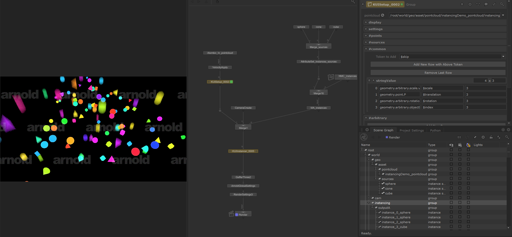

# Katana Uber Instancing (KUI)

Lua module designed for Katana OpScript feature. Trying to provide a flexible
solution for instancing based on point-cloud locations. 

Check the [main branch](https://github.com/MrLixm/KUI/tree/main) for the "production-ready" version.  

> New to Instancing ? I cover all the basic in this blog post :  
> https://mrlixm.github.io/blog/katana_instancing

# Features

- Instancing using `Hierarchical` and `Array` methods. Seamlessy swapable.
- Flexible :
  - Add arbitrary attributes on the fly
  - Convert TRS attributes to Matrices
  - Degree/radian conversions for rotations
  - Render engine agnostic
- Motion Blur support
- Logging and error handling.

# Documentation

> Or see the [./doc directory](doc).

# Legal

Apache License 2.0

See [LICENSE.md](./LICENSE.md) for full licence.

- ✅ The licensed material and derivatives may be used for commercial purposes.
- ✅ The licensed material may be distributed.
- ✅ The licensed material may be modified.
- ✅ The licensed material may be used and modified in private.
- ✅ This license provides an express grant of patent rights from contributors.
- 📏 A copy of the license and copyright notice must be included with the licensed material.
- 📏 Changes made to the licensed material must be documented

You can request a specific license by contacting me at [monsieurlixm@gmail.com](mailto:monsieurlixm@gmail.com) .

 
