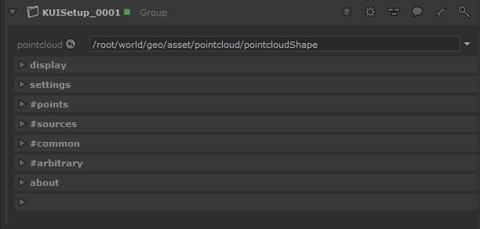
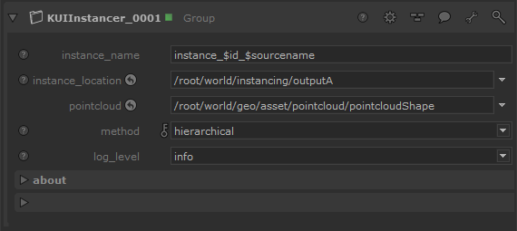

# Source Configuration using KUI node

[](../README.md)
[](INDEX.md)
[](CONFIG_NODE.md)
[](CONFIG_MANUAL.md)
[](CULLING.md)
[](API.md)
[](DEVELOPER.md)

# Installation

You can find at the root of this 2 `.macro` files that can be used in Katana
to quickly create a node with everything configured for you.

> To install a Katana macro please check the [Katana documentation](https://learn.foundry.com/katana/Content/ug/groups_macros_super_tools/macros.html).

The other option is to use the [KUI_Nodes.xml](../KUI_Nodes.xml) file.
You can open it with any text editor, copy it's content, and paste it into
your Katana Nodegraph. As simple as that.

# Use

KUI is divided in 2 nodes, one for setting the source point-cloud (KUISetup), 
another to actually produce the instances (KUIInstancer).


## KUISetup



Can be placed after the node importing the source point-cloud in the scene.

Minimal setup is :

- Set the `pointcloud` parameter with the scene-graph location of the pointcloud

- In the `#sources` group, set at least one instance-source with index 0

- In the `#common` group, set at least the `$points` and `$translation` token.

- In the `#arbitrary` group, you can remove the existing row.

For the `#...` groups, they come with already some "demo" value set that will 
need to be overriden depending on your point-cloud data.

> ❕ The `Add New Row` and `Remove Last Row` button you can find in the `#...` groups
> will delete and recreate the node once their function is finished. This is a
> hack to force-update the bottom `stringValue` tele-parameter. The re-created node
> is an exact copy of the one before you clicked, but I'm just warning you if
> ever you experience some weird behavior. (feel free to fill an Issue)

### pointcloud

Scene-graph location of the pointcloud to use for instancing

### display.point_width

Control the width of the point in the `viewer`. Not used for rendering.

### display.visible_in_render

Make the point-cloud location invisible at render-time if set to `No`. Most
render-engine will be able to read point-clouds and render them with spheres.
That's why we have to hide them.

### settings.Degree to Radian Conversion

Convert the rotation tokens to degree or radian.
Happens after the initial values have been multiplied/offseted.

### settings.TRS to Matrix Conversion

If enabled, the `translation`, `rotationX/Y/Z` and `scale` attributes are converted
to a 4x4 identity matrix (the matrix attribute). 
Make sure at least one of the TRS attribute is specified. 

The rotations values are excepted to be degrees. 

> ⚠ This feature requires Katana 4.0 + to be used.

### #sources

Specify the instance-sources and their corresponding index here.

First column is the instance-source scene-graph location.

Second column is its associated index (see `$index` token)

### #common

Common use a token system to map the point-cloud attribute to a commonly used
type of attribute. The list of supported is :
```
$points
$index
$skip
$hide
$matrix
$scale
$translation
$rotation
$rotationX
$rotationY
$rotationZ
```

You can create a row with one of this token using the 
`Add New Row with Above Token` button. 

The column setup is as follows :

  - `[1*n]` = attribute path relative to the source.
  - `[2*n]` = token to specify what kind of data [1] corresponds to.
  - `[3*n]` = value grouping : how much value belongs to an individual point.
  - `[4*n]` = value multiplier : quick way to multiply all values.
  - `[5*n]` = value add : quick way to offset all values by adding/subtracting a value.
  
### #arbitrary

If you need to add other attribute not listed in `#common`. 

The column setup is as follows :

  - `[1*n]` = attribute path relative to the source (pointcloud).
  - `[2*n]` = target attribute path relative to the instance.
  - `[3*n]` = value grouping : how much value belongs to an individual point.
  - `[4*n]` = value multiplier : quick way to multiply values.
  - `[5*n]` = value add : quick way to offset all values by adding/subtracting a value.
  - `[6*n]` = (optional) additional attributes that must be created on instance. Must be a valid Lua table.

For the 6th column please check [CONFIG_MANUAL.md#column-6](CONFIG_MANUAL.md#column-6).


## KUIInstancer



### instance_name

Name the instance(s) should have. If the `hierarchical` method is being used
you can use the following tokens: 

- `$id` (mandatory): replaced by point number can be suffixed by a number to add a digit padding, ex: $id3 can give 008.

- `$sourcename` : basename of the instance source location used

- `$sourceindex `: index attribute that was used to determine the instance source to pick.

`Array` method doesn't offer any tokens.

### instance_location

The target "group" location for instance(s). Can be a non-existing yet location.

### pointcloud

Scene-graph location of the point-cloud set by `KUISetup` node.

### method

Choose your instancing method.

### log_level

Set the level of message displayed in the console. It is not recommended to 
use debug when having a huge number of points on the point-cloud. (>100).

---
[](../README.md)
[](INDEX.md)
[](CONFIG_NODE.md)
[](CONFIG_MANUAL.md)
[](CULLING.md)
[](API.md)
[](DEVELOPER.md)
